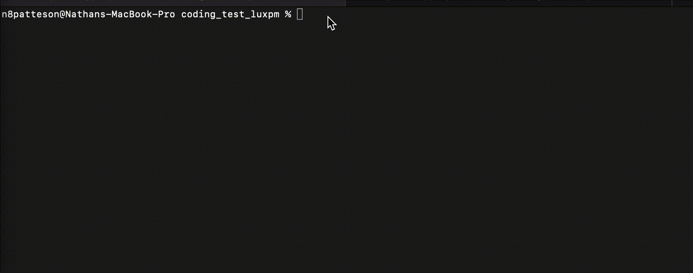
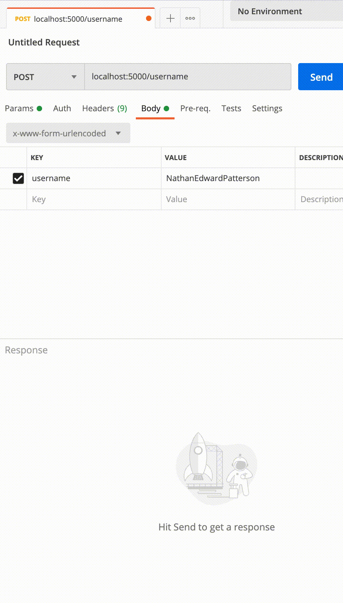

# LuxPM backend example

This project creates a python script that generates the first 20 odd numbers from 0. Then this script inserts the last n digits of the odd numbers you have created in the reverse order in between each letter.

Then, a REST api is created which calls the python script and allows you to POST a new string to be processed by the python script and then saved into a database by saving the letters and numbers separately one by one in order.

Finally, another GET call is created to get all the info from the database of processed strings.

---

## Installation Guide

Before running the application first setup HOST and DB inside of config/mysql.js

Then type the following in your termainal where you downloaded the code

```
  npm install

  npm start
```

Example:



---

## Examples

In order to add a new string to be processed by the python script and added to the database do a POST to the folowing /username endpoint and pass a {username: NathanEdwardPatterson} key, value in the body.

Example with postman:



In order to get all information from the database do a GET to the folowing /usernames endpoint.

Example with postman:


---

## Contributors 

Nathan Patterson

Email: nathan.e.patterson@gmail.com

[LinkedIn](https://www.linkedin.com/in/natepatterson/)

[Personal Site](https://www.n8patterson.com)

---

## License

MIT License
Copyright (c) [2021] [Nathan Patterson]

Permission is hereby granted, free of charge, to any person obtaining a copy of this software and associated documentation files (the "Software"), to deal in the Software without restriction, including without limitation the rights to use, copy, modify, merge, publish, distribute, sublicense, and/or sell copies of the Software, and to permit persons to whom the Software is furnished to do so, subject to the following conditions:

The above copyright notice and this permission notice shall be included in all copies or substantial portions of the Software.

THE SOFTWARE IS PROVIDED "AS IS", WITHOUT WARRANTY OF ANY KIND, EXPRESS OR IMPLIED, INCLUDING BUT NOT LIMITED TO THE WARRANTIES OF MERCHANTABILITY, FITNESS FOR A PARTICULAR PURPOSE AND NONINFRINGEMENT. IN NO EVENT SHALL THE AUTHORS OR COPYRIGHT HOLDERS BE LIABLE FOR ANY CLAIM, DAMAGES OR OTHER LIABILITY, WHETHER IN AN ACTION OF CONTRACT, TORT OR OTHERWISE, ARISING FROM, OUT OF OR IN CONNECTION WITH THE SOFTWARE OR THE USE OR OTHER DEALINGS IN THE SOFTWARE.
